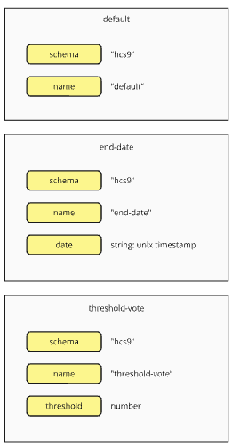

title: end-condition-rules module
sidebar_position: 9
---


#### [ hcs9 - Poll Metadata Schema ]

The end-condition-rules module defines the rules around how the poll end is determined. 

```
{
    "schema" - the schema that defines the structure of this module
    "rules" - an array of rules that govern the update action
}
```


The JSON Schema file can be found on here: [update-rules.json](../../../assets/schema/update-rules.json)

## Fields

### schema

**Tags:** required, case-insensitive

` "schema" : { "type" : "string" }`

The *schema* field defines the schema that is being used. It is any identifiable string about the standard or platform that the data follows. A developer who wishes to implement the schema will use the schema to filter data that they support and process it appropriately.

For the hcs9 standard, the schema is defined as hcs9-update-rules. 

### rules

**Tags:** optional

Rules is an array of [rules](./rules.md) that define additional behaviours. 

Available rules defined by this standard:

default - The poll only closes when the manage action changes the status to close

end-date - The poll will automatically close at the specified date
- date: string, unix date

threshold-votes - The poll will automatically close when the specified threshold is met.
- threshold: number, when a successful vote actions causes the total votes on the poll to meet or exceed this number of votes the poll is automatically closed.



***Default Behaviour***

If rules is not defined then the poll can only end if a Manage action changes the poll status to Closed.