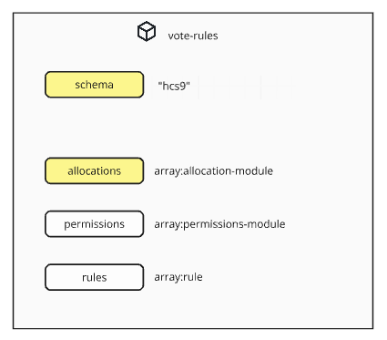

#### [ hcs9 - Poll Metadata Schema ]

The vote-rules module defines the rules around the vote action.

```
{
    "schema" - the schema that defines the structure of this module
    "allocations" - array of allocation-module which defines distribution of weight to users
    "permissions" - array of permissions-module which defines who is allowed to use the vote action
    "rules" - an array of rules that govern the vote action
}
```



The JSON Schema file can be found on here: [vote-rules.json](../../../assets/schema/vote-rules.json)

## Fields

### schema

**Tags:** required, case-insensitive

` "schema" : { "type" : "string" }`

The *schema* field defines the schema that is being used. It is any identifiable string about the standard or platform that the data follows. A developer who wishes to implement the schema will use the schema to filter data that they support and process it appropriately.

For the hcs9 standard, the schema is defined as hcs9-vote-rules.

### allocations

**Tags:** optional, module

Allocations is an array of modules that define how much weight each user receives for the poll. 

This specification implements a number of default allocation modules. This is covered more in detail on the [Vote Rules Implementation](../implementation/vote-rules-implementation.md) page.

**Default Behaviour** 

If allocations is not defined, every user receives 1 weight as the default behaviour.


### permissions

**Tags:** optional, module

Permissions is an array of modules that define who is allowed to perform the vote action.

Permissions are used for this purpose for every action. This specification implements a number of default permission modules. This is covered in more detail on the [Permissions](./permissions.md) page.

**Default Behaviour**

If permissions is not defined, all users are allowed to vote.

### rules

**Tags:** optional

Rules is an array of [rules](./rules.md) that define additional behaviours. 

This specification implements a number of default rules. This is covered more in detail on the [Vote Rules Implementation](../implementation/vote-rules-implementation.md) page.

**Default Behaviour**

If no rules are defined, all users are allowed take one vote action as the default behaviour.
